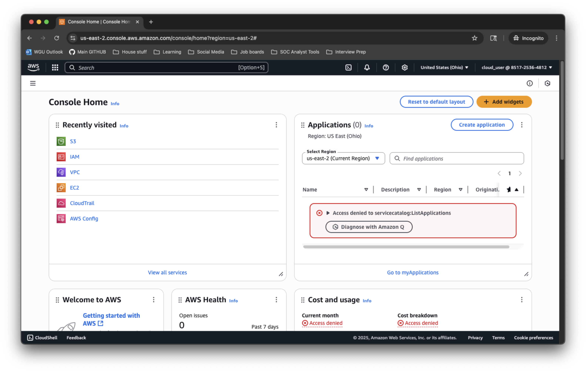
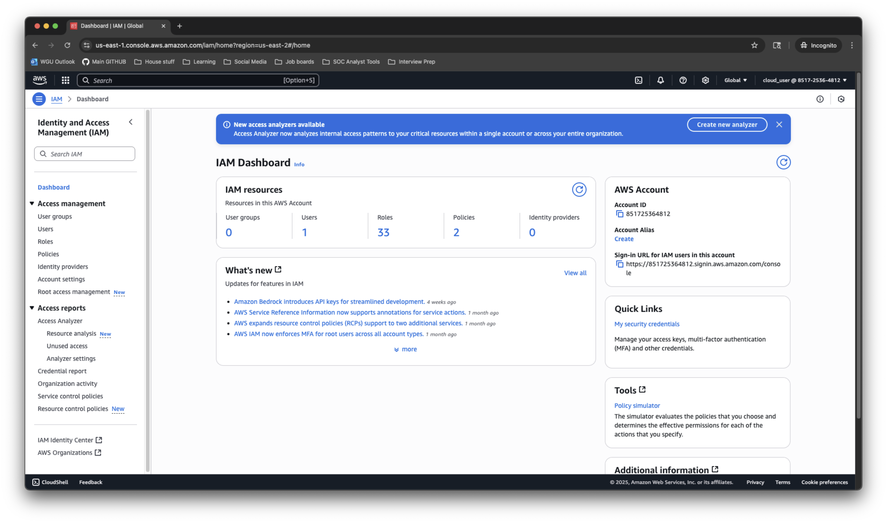
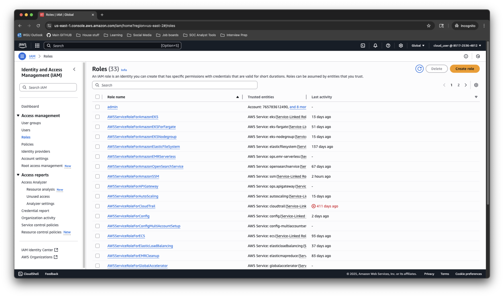
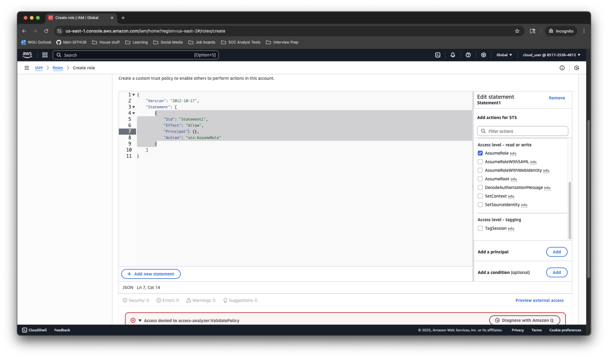
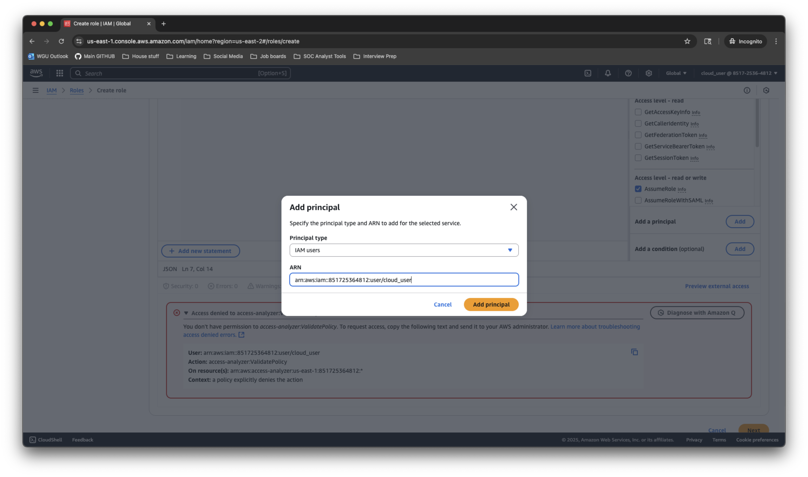
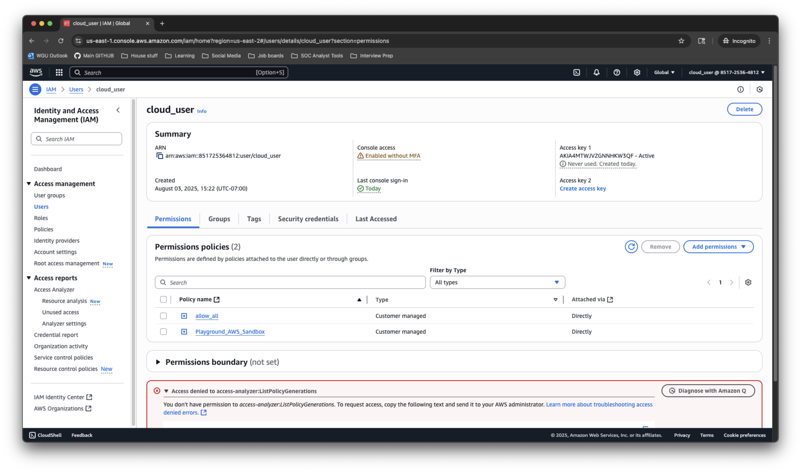

# Creating IAM Role and assigning to a IAM User

## 📌 Project Summary
This project demonstrates how to create and assign roles in AWS IAM. Roles in AWS are used for temporary permissions different from your default identity.

## 🎯 Objectives
 1) Understand what IAM roles are and why they are used in AWS
 2) Create an IAM role in AWS Management Console
 3) Attach a basic AWS Managed policy to the role
 4) Assign the IAM role to a user
 5) Verify the user can access only policies set by the role
 6) Switch back to default identity
---

## 🛠️ Tech Stack
| Service | Purpose |
|--------|---------|
| **AWS IAM** | Creation of roles, policies and trust relationships |
| **AWS Management Console**| GUI Used to create IAM roles and attach policies |

---

## 🪜  Instructions

### Step 1: Get to Roles menu from AWS Management Console
---
  - Search and Click on IAM from the AWS Dashboard
    

  - Click on 'Roles'located in the side menu
    
### Step 2: Create a role  
  - Click 'Create a Role'
    
  - Click 'Custom Trust Policy'
    
  - Click 'Add A Principle'
     
  - Principle Type Choose 'IAM User'
     
    
  - ARN copy and paste the ARN of the IAM user you want to assume this role
    
  - Click 'Add Principle'
  - Click 'Next'
  - Add Policies that you want this role to have
  - Click 'Next'
  - Name the role & Provide a short description of the role
  - Click 'Create Role'
### Step 3: Login using the assigned role
  - Go back to IAM Dashboard
  - Click on 'Roles'
  - Click on the role you created
  - Copy the link where it says 'Link to switch roles in console'
  - Paste into the URL
  - Type in a Display Name and choose a color
  - Click 'Switch Role'
### Step 4: Verify if your permissions has changed between your default identity and the new Role
### Step 5: Switch back to default identity
  - Click on your Display name in the top right corner
  - Click 'Switch Back'
    
